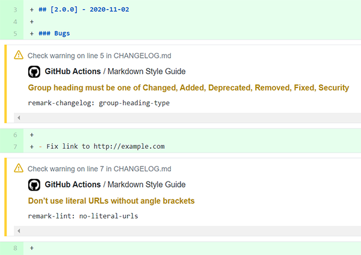

# hallmark-lint-action

**A [GitHub Action](https://github.com/features/actions) to lint markdown files with [`hallmark`](https://github.com/vweevers/hallmark).**


[](https://github.com/vweevers/hallmark)
[](https://standardjs.com)

## Usage

```yaml
- name: Checkout
  uses: actions/checkout@v2
- name: Markdown Style Guide
  uses: vweevers/hallmark-lint-action@v1
  with:
    token: ${{ secrets.GITHUB_TOKEN }}
```

## Example



## Inputs

- `token` (required): GitHub token for creating status checks with annotations
- `files`: newline-separated glob patterns of files to lint, default is `*.md`.

Hallmark can be further configured via [`package.json` or `.hallmarkrc`](https://github.com/vweevers/hallmark).

## License

[GPL-3.0](LICENSE)
